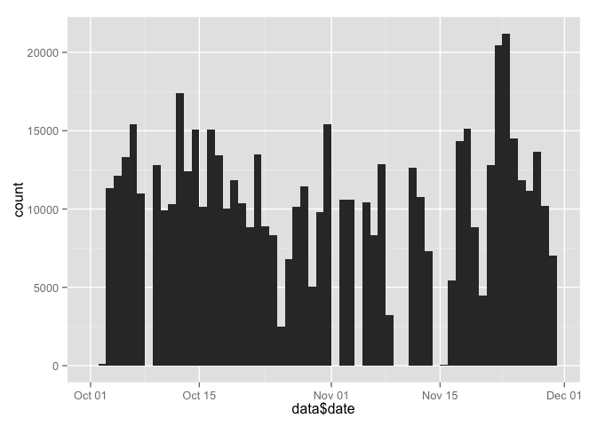
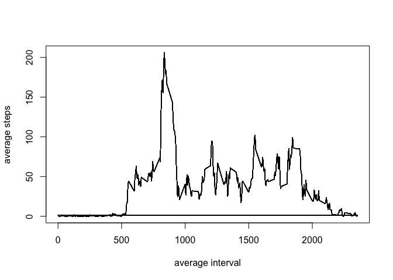
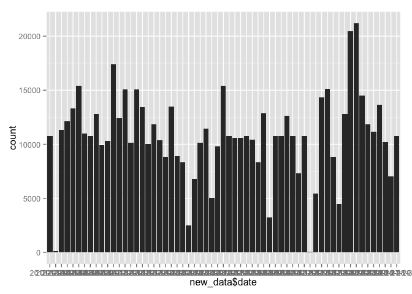
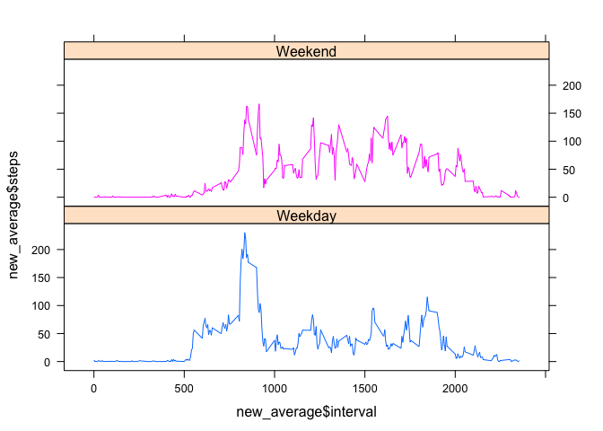

# Reproducible Research: Peer Assessment 1
## Loading and preprocessing the data


```r
initial_data <- read.csv("activity.csv")
data <- na.omit(initial_data)
data$date <- as.Date(data$date)
```
## What is mean total number of steps taken per day?
Make a histogram of the total number of steps taken each day


```r
library(ggplot2)
plot1 <- qplot(data$date, weight=data$steps, geom="histogram",binwidth=1) 
print(plot1)
```

 

Calculate and report the mean and median total number of steps taken per day

```r
mean(tapply(data$steps, data$date, sum))
```

```
## [1] 10766.19
```

```r
median(tapply(data$steps, data$date, sum))
```

```
## [1] 10765
```

## What is the average daily activity pattern?
Make a time series plot (i.e. type = "l") of the 5-minute interval (x-axis) and the average number of steps taken, averaged across all days (y-axis)


```r
average<-data.frame(cbind(data$interval,tapply(data$steps, data$interval, mean )))
colnames(average) <- c("interval","steps")

plot(average$interval,average$steps,type="l",xlab="average interval",ylab="average steps")
```

 

Which 5-minute interval, on average across all the days in the dataset, contains the maximum number of steps?


```r
 average[average$steps== max(average$steps), ]
```

```
##       interval    steps
## 104        835 206.1698
## 392        835 206.1698
## 680        835 206.1698
## 968        835 206.1698
## 1256       835 206.1698
## 1544       835 206.1698
## 1832       835 206.1698
## 2120       835 206.1698
## 2408       835 206.1698
## 2696       835 206.1698
## 2984       835 206.1698
## 3272       835 206.1698
## 3560       835 206.1698
## 3848       835 206.1698
## 4136       835 206.1698
## 4424       835 206.1698
## 4712       835 206.1698
## 5000       835 206.1698
## 5288       835 206.1698
## 5576       835 206.1698
## 5864       835 206.1698
## 6152       835 206.1698
## 6440       835 206.1698
## 6728       835 206.1698
## 7016       835 206.1698
## 7304       835 206.1698
## 7592       835 206.1698
## 7880       835 206.1698
## 8168       835 206.1698
## 8456       835 206.1698
## 8744       835 206.1698
## 9032       835 206.1698
## 9320       835 206.1698
## 9608       835 206.1698
## 9896       835 206.1698
## 10184      835 206.1698
## 10472      835 206.1698
## 10760      835 206.1698
## 11048      835 206.1698
## 11336      835 206.1698
## 11624      835 206.1698
## 11912      835 206.1698
## 12200      835 206.1698
## 12488      835 206.1698
## 12776      835 206.1698
## 13064      835 206.1698
## 13352      835 206.1698
## 13640      835 206.1698
## 13928      835 206.1698
## 14216      835 206.1698
## 14504      835 206.1698
## 14792      835 206.1698
## 15080      835 206.1698
```

## Imputing missing values
Calculate and report the total number of missing values in the dataset (i.e. the total number of rows with NAs)


```r
sum(is.na(initial_data$steps))
```

```
## [1] 2304
```

Devise a strategy for filling in all of the missing values in the dataset. The strategy does not need to be sophisticated. Using the 5 minute interval..
Create a new dataset that is equal to the original dataset but with the missing data filled in.


```r
new_data <- initial_data
for (i in 1:nrow(new_data)) {
    if (is.na(new_data$steps[i])) {
        new_data$steps[i] <- average[which(new_data$interval[i] == average$interval), ]$steps
    }
}
```

What is the impact of imputing missing data on the estimates of the total daily number of steps?

Make a histogram of the total number of steps taken each day 

```r
library(ggplot2)
plot2 <- qplot(new_data$date, weight=new_data$steps, geom="histogram",binwidth=1)
print(plot2)
```

 

and Calculate and report the mean and median total number of steps taken per day.


```r
newmean<-mean(tapply(new_data$steps, new_data$date, sum))
newmean
```

```
## [1] 10766.19
```

```r
newmedian<-median(tapply(new_data$steps, new_data$date, sum))
newmedian
```

```
## [1] 10766.19
```
Do these values differ from the estimates from the first part of the assignment?

```r
oldmean<-mean(tapply(data$steps, data$date, sum))
oldmedian<-median(tapply(data$steps, data$date, sum))

newmean - oldmean
```

```
## [1] 0
```

```r
newmedian - oldmedian
```

```
## [1] 1.188679
```
## Are there differences in activity patterns between weekdays and weekends?
Create a new factor variable in the dataset with two levels – “weekday” and “weekend” indicating whether a given date is a weekday or weekend day.

```r
new_data$date <- as.Date(new_data$date)
new_data$day<-as.factor(ifelse(weekdays(new_data$date) %in% c("Saturday","Sunday"),"Weekend","Weekday"))

#just to check what are the days of the week it falls in
new_data$weekdays <- factor(format(new_data$date, "%A"))
```
Make a panel plot containing a time series plot (i.e. type = "l") of the 5-minute interval (x-axis) and the average number of steps taken, averaged across all weekday days or weekend days (y-axis). 

```r
new_average <- aggregate(new_data$steps, 
                      list(interval = as.numeric(as.character(new_data$interval)), 
                           weekdays = new_data$day),
                      FUN = "mean")
colnames(new_average) <- c("interval","weekday","steps")

library(lattice)

xyplot(new_average$steps ~ new_average$interval | new_average$weekday, layout = c(1, 2), type = "l", group=new_average$weekday)
```

 
